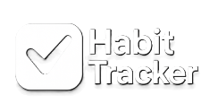

# 📱 Habit Tracker App

<div align="center">



**แอปพลิเคชันติดตามนิสัยประจำวัน ที่ช่วยให้คุณสร้างและรักษานิสัยดีๆ ได้อย่างต่อเนื่อง**

[](https://reactnative.dev/)
[](https://expo.dev/)
[](https://www.typescriptlang.org/)
[](https://firebase.google.com/)

</div>

---

## 📖 เกี่ยวกับโปรเจค

Habit Tracker App คือแอปพลิเคชันช่วยติดตามนิสัยประจำวันที่พัฒนาด้วย **React Native (Expo)** และ **Firebase** ออกแบบมาเพื่อช่วยให้ผู้ใช้สามารถ:

- ✅ สร้างและจัดการนิสัยประจำวันของตัวเอง
- 📅 ติดตามความคืบหน้าด้วยปฏิทินแบบไทย (พ.ศ.)
- 🔔 ตั้งเตือนเวลาทำกิจกรรมต่างๆ
- 📊 ดูสถิติและกราฟแสดงผลลัพธ์
- 🎨 ปรับแต่งสี ไอคอน และเวลาของแต่ละนิสัย
- 🔐 ระบบล็อกอินที่ปลอดภัยด้วย Firebase Authentication

---

## ✨ ฟีเจอร์หลัก

### 🏠 หน้าหลัก (Home)

- แสดงนิสัยทั้งหมดในวันที่เลือก
- ปฏิทินแบบเลื่อนดูวันที่ต่างๆ
- เช็คทำนิสัยเสร็จแล้วหรือยัง
- แสดงเวลาและรายละเอียดของแต่ละนิสัย

### ➕ เพิ่มนิสัยใหม่

- ตั้งชื่อและรายละเอียดนิสัย
- เลือกสี ไอคอน (34+ ไอคอนให้เลือก)
- ตั้งเวลาเตือน
- กำหนดวันเริ่มต้น-สิ้นสุด
- ตั้งค่าการทำซ้ำ (ทุกวัน, จันทร์-ศุกร์, หรือเลือกวันเอง)

### ✏️ แก้ไขนิสัย

- แก้ไขข้อมูลนิสัยที่มีอยู่
- อัพเดทเวลาแจ้งเตือน
- ลบนิสัยที่ไม่ต้องการ

### 🔍 จัดการนิสัย

- ค้นหานิสัยที่ต้องการ
- แก้ไขหรือลบนิสัย
- ดูรายการนิสัยทั้งหมด

### 📊 สถิติ

- กราฟแสดงผลสำเร็จ/ล้มเหลว 7 วันย้อนหลัง
- ปฏิทินแสดงวันที่ทำนิสัยสำเร็จ
- สรุปจำนวนวันต่อเนื่อง (Streak)

### 👤 โปรไฟล์

- จัดการบัญชีผู้ใช้
- ตั้งค่าการแจ้งเตือน
- ออกจากระบบ (แบบ Manual Logout ต้องใส่รหัสใหม่)

### 🔐 ระบบความปลอดภัย

- Firebase Authentication
- AsyncStorage สำหรับเก็บ Auth State
- Manual Logout ต้องล็อกอินใหม่ด้วยอีเมล/รหัสผ่าน
- Auto-login เมื่อปิด-เปิดแอป (ไม่ใช่ Manual Logout)

---

## 🛠️ เทคโนโลยีที่ใช้

| เทคโนโลยี                | เวอร์ชัน | คำอธิบาย                             |
| ------------------------ | -------- | ------------------------------------ |
| **React Native**         | 0.76.5   | Framework หลักสำหรับสร้าง Mobile App |
| **Expo**                 | ~52.0.20 | เครื่องมือพัฒนาและ Build             |
| **TypeScript**           | 5.3.3    | Type-safe JavaScript                 |
| **Firebase**             | 11.1.0   | Backend (Auth + Firestore Database)  |
| **React Navigation**     | 7.0.14   | Navigation System                    |
| **date-fns**             | 4.1.0    | จัดการวันที่และเวลา                  |
| **Expo Notifications**   | ~0.29.14 | ระบบแจ้งเตือน                        |
| **AsyncStorage**         | 2.0.0    | Local Storage                        |
| **Expo Linear Gradient** | ~14.0.1  | Gradient UI                          |

---

## 📦 การติดตั้ง

### ข้อกำหนดเบื้องต้น

- Node.js (v16 ขึ้นไป)
- npm หรือ yarn
- Expo Go App (สำหรับทดสอบบนมือถือ)
- บัญชี Firebase

### 1️⃣ Clone Repository

```bash
git clone https://github.com/TanawutFolk/Habit-tracker-app.git
cd Habit-tracker-app
```

### 2️⃣ ติดตั้ง Dependencies

```bash
npm install
```

หรือใช้ yarn:

```bash
yarn install
```

#### 📦 Dependencies ทั้งหมดที่จะถูกติดตั้ง:

**Core Dependencies:**
```bash
# React Navigation
npm install @react-navigation/native @react-navigation/native-stack

# Firebase
npm install firebase

# Date utilities
npm install date-fns

# AsyncStorage
npm install @react-native-async-storage/async-storage

# Expo packages
npx expo install expo-linear-gradient
npx expo install expo-notifications
npx expo install expo-local-authentication
npx expo install react-native-safe-area-context
npx expo install react-native-screens
```

**หรือติดตั้งทั้งหมดพร้อมกัน:**
```bash
npm install @react-navigation/native @react-navigation/native-stack firebase date-fns @react-native-async-storage/async-storage && npx expo install expo-linear-gradient expo-notifications expo-local-authentication react-native-safe-area-context react-native-screens
```

> 💡 **Tips:** ถ้าใช้ `npx expo install` จะช่วยให้ติดตั้งเวอร์ชันที่เข้ากันได้กับ Expo SDK โดยอัตโนมัติ

### 3️⃣ ตั้งค่า Firebase

#### 3.1 สร้าง Firebase Project

1. ไปที่ [Firebase Console](https://console.firebase.google.com/)
2. คลิก **"Add project"** หรือ **"สร้างโปรเจค"**
3. ตั้งชื่อโปรเจค เช่น `habit-tracker-app`
4. เปิดใช้ Google Analytics (ถ้าต้องการ)
5. คลิก **"Create project"**

#### 3.2 เพิ่ม Web App

1. ในหน้า Project Overview คลิกไอคอน **Web (</> icon)**
2. ตั้งชื่อแอป เช่น `Habit Tracker Web`
3. คลิก **"Register app"**
4. คัดลอก Firebase Configuration

#### 3.3 ตั้งค่าไฟล์ Config

1. คัดลอกไฟล์ตัวอย่าง:

```bash
# Windows
copy src\config\firebase.example.ts src\config\firebase.ts

# Mac/Linux
cp src/config/firebase.example.ts src/config/firebase.ts
```

2. เปิดไฟล์ `src/config/firebase.ts` และแก้ไขค่า:

```typescript
const firebaseConfig = {
  apiKey: "YOUR_API_KEY",
  authDomain: "YOUR_PROJECT_ID.firebaseapp.com",
  projectId: "YOUR_PROJECT_ID",
  storageBucket: "YOUR_PROJECT_ID.firebasestorage.app",
  messagingSenderId: "YOUR_MESSAGING_SENDER_ID",
  appId: "YOUR_APP_ID",
};
```

> ⚠️ **หมายเหตุ:** ไฟล์ `firebase.ts` จะไม่ถูก commit ขึ้น Git เพื่อความปลอดภัย

#### 3.4 เปิดใช้งาน Authentication

1. ในเมนูด้านซ้าย คลิก **"Authentication"**
2. คลิก **"Get started"**
3. เลือก **"Email/Password"**
4. เปิดใช้งาน **"Email/Password"**
5. คลิก **"Save"**

#### 3.5 สร้าง Firestore Database

1. ในเมนูด้านซ้าย คลิก **"Firestore Database"**
2. คลิก **"Create database"**
3. เลือก **"Start in test mode"** (สำหรับพัฒนา)
4. เลือกตำแหน่ง Server (แนะนำ `asia-southeast1`)
5. คลิก **"Enable"**

#### 3.6 ตั้งค่า Security Rules (แนะนำ)

ใน Firestore Database > Rules แก้เป็น:

```javascript
rules_version = '2';
service cloud.firestore {
  match /databases/{database}/documents {
    // Users collection
    match /users/{userId} {
      allow read, write: if request.auth != null && request.auth.uid == userId;
    }

    // Habits collection
    match /habits/{habitId} {
      allow read, write: if request.auth != null &&
                           request.auth.uid == resource.data.userId;
      allow create: if request.auth != null;
    }

    // Habits Log collection
    match /habitsLog/{logId} {
      allow read, write: if request.auth != null &&
                           request.auth.uid == resource.data.userId;
      allow create: if request.auth != null;
    }
  }
}
```

---

## 🚀 การรันแอป

### เริ่มต้น Development Server

```bash
npm start
```

หรือ

```bash
npx expo start
```

### รันบนแพลตฟอร์มต่างๆ

```bash
# iOS Simulator (ต้องมี Xcode)
npm run ios

# Android Emulator (ต้องมี Android Studio)
npm run android

# เปิดบนเว็บเบราว์เซอร์
npm run web
```

### ทดสอบบนมือถือจริง

1. ติดตั้งแอป **Expo Go** จาก App Store (iOS) หรือ Play Store (Android)
2. รัน `npm start`
3. สแกน QR Code ด้วยแอป Expo Go
   - **iOS**: ใช้กล้องของ iPhone
   - **Android**: ใช้ปุ่ม Scan QR Code ในแอป Expo Go

---

## 📂 โครงสร้างโปรเจค

```
HabitTrackerApp/
├── assets/                          # ไฟล์รูปภาพและไอคอน
│   ├── Habits_Icon/                # ไอคอนนิสัย (34 ไอคอน)
│   ├── SettingIcon/                # ไอคอนการตั้งค่า
│   ├── Logo.png                    # โลโก้แอป
│   └── ...
├── src/
│   ├── config/
│   │   ├── firebase.ts            # Firebase configuration (gitignored)
│   │   └── firebase.example.ts   # ตัวอย่าง Firebase config
│   ├── navigation/
│   │   ├── AppNavigator.tsx       # Navigation หลัก + Auth flow
│   │   ├── NavigationContext.tsx  # Context สำหรับ navigation
│   │   └── navigationHelper.ts    # Helper functions
│   ├── screens/
│   │   ├── LoginScreen.tsx        # 🔐 หน้าล็อกอิน
│   │   ├── RegisterScreen.tsx     # 📝 หน้าสมัครสมาชิก
│   │   ├── HomeScreen.tsx         # 🏠 หน้าหลัก (แสดงนิสัย)
│   │   ├── AddHabitScreen.tsx     # ➕ เพิ่มนิสัยใหม่
│   │   ├── EditHabitScreen.tsx    # ✏️ แก้ไขนิสัย
│   │   ├── HabitManagementScreen.tsx # 🔍 จัดการนิสัย
│   │   ├── StatisticScreen.tsx    # 📊 สถิติและกราฟ
│   │   ├── ProfileScreen.tsx      # 👤 โปรไฟล์ผู้ใช้
│   │   ├── AccountManagementScreen.tsx # ⚙️ จัดการบัญชี
│   │   ├── NotificationSettingsScreen.tsx # 🔔 ตั้งค่าการแจ้งเตือน
│   │   └── BiometricAuthScreen.tsx # 👆 Biometric Auth (ไม่ได้ใช้)
│   ├── types/
│   │   └── index.ts               # TypeScript interfaces
│   └── utils/
│       ├── biometricService.ts    # Biometric & Manual Logout detection
│       ├── navigationHelper.ts    # Navigation utilities
│       └── notificationService.ts # Local notifications
├── App.tsx                         # Entry point
├── app.json                        # Expo configuration
├── package.json                    # Dependencies
├── tsconfig.json                   # TypeScript config
└── README.md                       # เอกสารนี้
```

---

## 🗄️ โครงสร้าง Firestore Database

### Collection: `users`

```typescript
{
  uid: string,          // User ID จาก Firebase Auth
  email: string,        // อีเมล
  username: string,     // ชื่อผู้ใช้
  createdAt: Timestamp  // วันที่สร้างบัญชี
}
```

### Collection: `habits`

```typescript
{
  id: string,           // Document ID
  userId: string,       // User ID เจ้าของนิสัย
  title: string,        // ชื่อนิสัย
  description: string,  // คำอธิบาย
  time: string,         // เวลาทำนิสัย (HH:mm)
  icon: string,         // ชื่อไฟล์ไอคอน
  color: string,        // สีของการ์ด (Hex)
  completed: boolean,   // สถานะทำเสร็จ (ไม่ได้ใช้แล้ว)
  startDate: string,    // วันที่เริ่มต้น (dd/MM/yy)
  endDate: string,      // วันที่สิ้นสุด (dd/MM/yy)
  repeatDay: string,    // รูปแบบการทำซ้ำ
  createdAt: Timestamp  // วันที่สร้างนิสัย
}
```

### Collection: `habitsLog`

```typescript
{
  id: string,           // Document ID
  userId: string,       // User ID
  habitId: string,      // ID ของนิสัย
  date: string,         // วันที่ทำนิสัย (dd/MM/yyyy)
  count: number,        // จำนวนครั้ง (ไม่ได้ใช้)
  done: boolean,        // ทำเสร็จหรือยัง
  notes: string,        // บันทึกเพิ่มเติม
  createdAt: Timestamp  // วันที่บันทึก
}
```

---

## 🎨 ฟีเจอร์พิเศษ

### 🌟 Modern UI Design

- ลด border radius ทุกหน้าให้ดูคมและทันสมัยขึ้น
- ใช้ Linear Gradient สำหรับปุ่มสำคัญ
- Fade animation เวลาเปลี่ยนหน้า (200-220ms)

### 📅 ปฏิทินไทย

- แสดงวันที่แบบพุทธศักราช (พ.ศ.)
- ใช้ date-fns สำหรับจัดการวันที่
- รองรับภาษาไทย

### 🔔 ระบบแจ้งเตือน

- Local Notification ด้วย Expo Notifications
- ตั้งเวลาแจ้งเตือนสำหรับแต่ละนิสัย
- รองรับการยกเลิกและอัพเดทการแจ้งเตือน

### 🔐 ระบบความปลอดภัย

- Firebase Authentication
- AsyncStorage Persistence (Auth state คงอยู่หลังปิดแอป)
- Manual Logout Detection (ออกจากระบบเองต้องใส่รหัสใหม่)
- Password visibility toggle

---

## 📱 หน้าจอต่างๆ

| หน้าจอ                    | คำอธิบาย                                                      |
| ------------------------- | ------------------------------------------------------------- |
| **Login**                 | เข้าสู่ระบบด้วยอีเมล/รหัสผ่าน, จำรหัสผ่าน, Biometric (รองรับ) |
| **Register**              | สมัครสมาชิกใหม่                                               |
| **Home**                  | แสดงนิสัยประจำวัน, ปฏิทิน, เช็คทำเสร็จ                        |
| **Add Habit**             | เพิ่มนิสัยใหม่ (ชื่อ, สี, ไอคอน, เวลา, การทำซ้ำ)              |
| **Edit Habit**            | แก้ไขนิสัยที่มีอยู่                                           |
| **Habit Management**      | ค้นหา, แก้ไข, ลบนิสัย                                         |
| **Statistics**            | กราฟ 7 วัน, ปฏิทินแสดงผล, Streak                              |
| **Profile**               | ดูข้อมูลผู้ใช้, ตั้งค่า, ออกจากระบบ                           |
| **Account Management**    | แก้ไขชื่อผู้ใช้, เปลี่ยนรหัสผ่าน                              |
| **Notification Settings** | ตั้งค่าการแจ้งเตือน, เสียงแจ้งเตือน                           |

---

### การ Contribute

1. Fork โปรเจค
2. สร้าง Feature Branch (`git checkout -b feature/AmazingFeature`)
3. Commit การเปลี่ยนแปลง (`git commit -m 'Add some AmazingFeature'`)
4. Push ไปยัง Branch (`git push origin feature/AmazingFeature`)
5. เปิด Pull Request

---

## 🐛 การแก้ปัญหา

### แอปไม่สามารถเชื่อมต่อ Firebase

1. ตรวจสอบว่าไฟล์ `src/config/firebase.ts` มีค่า config ถูกต้อง
2. เช็คว่า Firebase Authentication และ Firestore ถูกเปิดใช้งาน
3. ดู Firebase Console > Usage เพื่อเช็ค quota

### Notification ไม่แสดง

1. ตรวจสอบ Permission ในการตั้งค่ามือถือ
2. ดู Expo Notifications documentation
3. ทดสอบบนเครื่องจริง (Simulator/Emulator อาจมีข้อจำกัด)

### แอปช้า / Lag

1. ลองรัน `npm start -- --clear` เพื่อล้าง cache
2. ตรวจสอบ Firestore queries (ใช้ index ถ้าจำเป็น)
3. ลด console.log ในโค้ด

---

## 📄 License

ยังไม่ได้กำหนด License (สงวนลิขสิทธิ์)

---

## 👨‍💻 ผู้พัฒนา

**TanawutFolk**

- GitHub: [@TanawutFolk](https://github.com/TanawutFolk)
- Repository: [Habit-tracker-app](https://github.com/TanawutFolk/Habit-tracker-app)

---

## 🙏 ขอบคุณ

- [React Native](https://reactnative.dev/)
- [Expo](https://expo.dev/)
- [Firebase](https://firebase.google.com/)
- [React Navigation](https://reactnavigation.org/)
- [date-fns](https://date-fns.org/)
- ไอคอนต่างๆ จาก community

---

<div align="center">

**สร้างด้วย ❤️ และ ☕**

Made with React Native + Firebase

</div>
